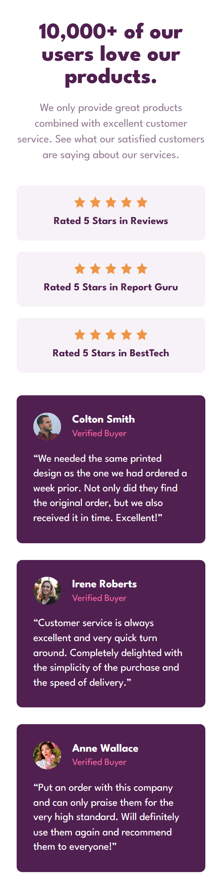

# Frontend Mentor - Social Proof Section

This is a solution to the [Social Proof Section challenge](https://www.frontendmentor.io/challenges/social-proof-section-6e0qTv_bA) on Frontend Mentor.  
Frontend Mentor challenges help you improve your coding skills by building realistic projects.

---

## Overview

### Screenshot

### Links

- Live Site URL: [Add live site link here](https://telmomanduco.github.io/social-proof-section-master/)
- Solution URL: [Add solution link here](https://www.frontendmentor.io/solutions/responsive-social-proof-section---flex-zfYS1B7-9D)

---

## My Process

### Built With

- Semantic HTML5 markup
- CSS custom properties
- Flexbox
- Mobile-first workflow

---

## Author

- Frontend Mentor - [@TelmoManduco](https://www.frontendmentor.io/profile/yourusername)
